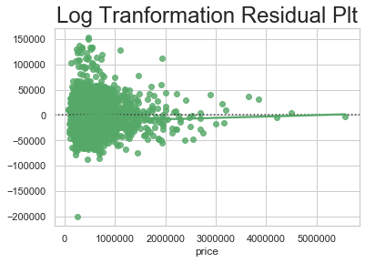

# King County Housing Price Prediction

## TL;DR:
- Naive Model has a R Square:  0.703 and Root Mean Squared Error:  198865.03
- Linear Regression has a R Square:  0.843 and Root Mean Squared Error:  151170.08 using SelectKBest. 
- Log Tranformation Regression has a R Square:  0.7976322510661107 and Root Mean Squared Error: 157168.25 using SelectKBest. 
- Polynomial Second Degree Tranformation has a R Square: 352526.055 and Root Mean Squared Error: 392172.30 using SelectKBest.

## Overview: 
 Due to COVID-19, a lot of people are working remotely and have moved off to states with friendlier living cost. However, before moving, we search the internet to find a house for the best price. Therefore, companies like Zillow and Streeteasy might want to make sure that their customers get the best deals for the house. In order to do that, they would need a crystal ball that would predict the scores. Unfortunatly, crystal balls do not exisit but thankfully, Data Scientist do and we can create a Machine Learning algorithm that can predict the housing price given certain features. 

In this project, I will create predictive model that will predict the price of a house given certain features. In order to do so, I will first conduct an exploratory data analysis to examine the dataset. I will then perfom feature engeinering and feature selection, along with linear and non-linear regression methods to measure R square values and Root Mean Squar Error to find the optimal model.   

# Business Questions: 
- Does the grading received by a house really affect the pricing? 
- Does the amount of bedroom affect the pricing? 
- Does the waterfront view affect pricing? 

### Data Interpretation:
There is a statistically significant difference in the prices when compared between the grades (p<0.05).  

There is a statistically significant difference in the price when compared between the amount of bedrooms present at a house. However, it is not a linear relationship based on the evidence provided. 

There is a statistically significant difference in the price between a house with a water front view and without a view. This figure, also illustrates that there is/are outliers in both groups. 

There also is a statistically significant differences in the prices when comapring the amount of bathrooms present at a house.

- Naive Model has a R Square: 0.703 and Root Mean Squared Error: 198865.03

- Linear Regression has a R Square: 0.843 and Root Mean Squared Error: 151170.08 using SelectKBest. When comparing the RMSE, the Linear Regression performed the best. Therefore, I proceed to fit and train my model using the linear regression. 

- Log Tranformation Regression has a R Square: 0.7976322510661107 and Root Mean Squared Error: 157168.25 using SelectKBest. 

- Polynomial Second Degree Tranformation has a R Square: 352526.055 and Root Mean Squared Error: 392172.30 using SelectKBest.

#### The data used in this project was provided by Flatiron School and gathered via data entry by Brendan Ferris to fulfil the dataset. 
- kc_house_data_train.csv is the dataset used for training the model
- kc_house_data_test_features.csv is the dataset used for predicing the price of the house via the training model
- bedroomsfilled.csv is a data entry set from zillow to fill out NaN values for bedrooms == 0 
- zip_code_extra_data_fixed.csv is a data entry set from https://www.unitedstateszipcodes.org/ 
- prices.csv is the dataset extracted from the training set to decrease confusion
- date.csv is the dataset extracted from the training set to decrease confusion

# Next Steps
For my next steps, I would like to further explore the relationships between each variable.
Currently, it is very unstable and buggy. Once I learn more about Machine Learning Algorithms, I would like to stabalize the code and its structure/syntax.

# For more information
Please read my [full analysis](https://github.com/dorjeys3/King_County_Real_Estate/blob/master/Final%20Notebook.ipynb) for further clarification. 
For additional information on the project and myself, please concat me at Dorjeys3@gmail.com or find me on twitter @dorjeys3 

# Repository Contents 
>`images`:Folder with images used in the project

>`rawdata`:Folder with raw data used for data cleaning

>`Datasets`:Folder with all the data provided by Flatiron School and Brendan Ferris

>`.gitignore`:Please ignore

>`Final Notebook.ipynb`:Cleaned data for [review](https://github.com/dorjeys3/Movies-Analysis/blob/master/Microsoft%20Movie%20Analysis.ipynb)

>`lm_final.pickle`:Pickle of my linear regression model

>`README`:Preview file for GitHub Repo
